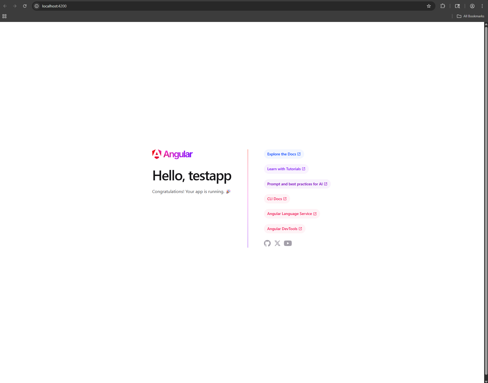

# Activity 2

- Author:  Hunter Bryant
- Date:  10 March 2026

## Introduction

[Angular](https://angular.dev/) is a TypeScript-based free and open-source single-page web application framework, developed by Google.  This activity will install the Angular software and start up an instance of an Angular application 

## Activity 2 Commands

- Install the latest version of Angular

```
npm install -g @angular/cli@latest
```

- Display the Angular Version

```
ng version
```

- Create a new Angular project, this case we will call testapp

```
ng new testapp
```

- Change directory to the new project and start the server

```
cd testapp
ng serve
```

## Test Links

- http://localhost:4200



## Conclusion

- This was a simple assignment, a hello world Angular program

## Troubleshooting

|Issue|Solution|
|--|--|
|Image was not displaying|Made an images folder|
