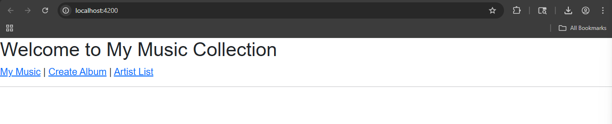
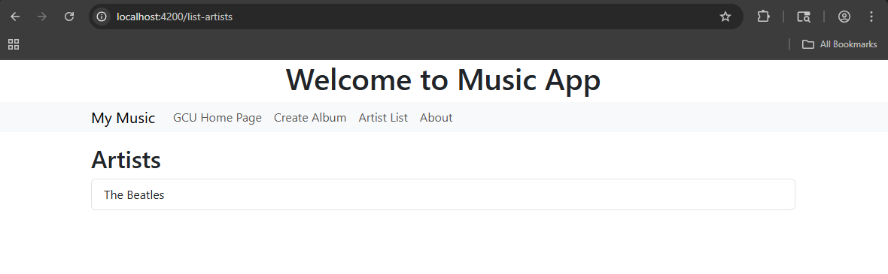
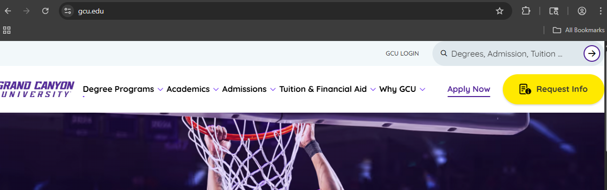
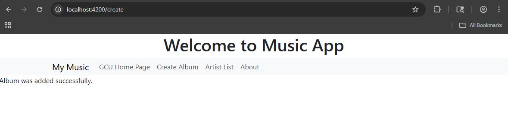
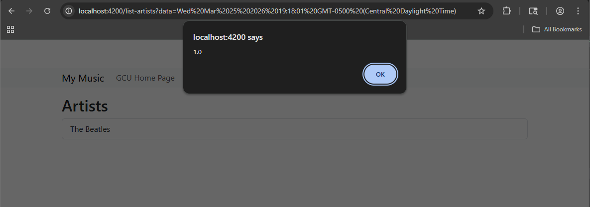

# Activity 3

- Author:  Hunter Bryant
- Date:  25 March 2026

## Introduction

- In the activity I am too start building a simple music app that can display artists, albums, and allow the visiter to edit them each. As well as using angular to help complete the assignment. 

## Links

- [sample-music-data.json](https://gitlab.com/bobby.estey/gcu-cst391/-/blob/main/sample-music-data.json)
 
## Music App Deliverables

- Above is an image of what is displayed after running ng serve in the git bash terminal. 

- Captioned screenshots with explanations of each page
     - The initial application page
     

     - GCU homepage
     

     - Create Album page
     

     - Artist List page showing your added album/artist
      

     

     - About Box
     

## Conclusion

- Most of the issues have been resolved. I did not update the code in activity 3, since I have all of the correct code in activity 4 which is already submitted. 

## Troubleshooting

|Issue|Solution|
|--|--|
|ng new simpleapp --no-standalone|- Angular 17, when creating a new application without standalone requires the "--no-standalone" option to access the app.module.ts file|

