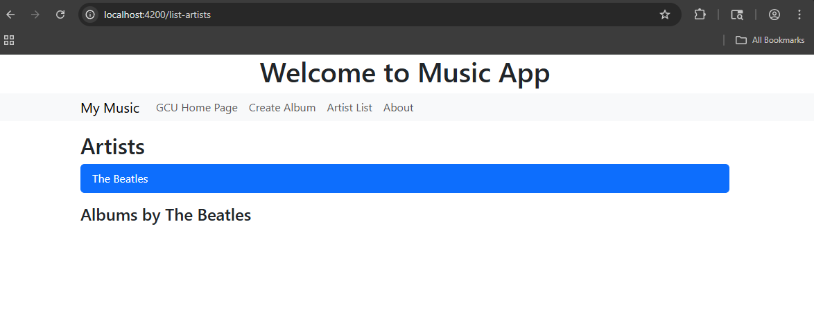
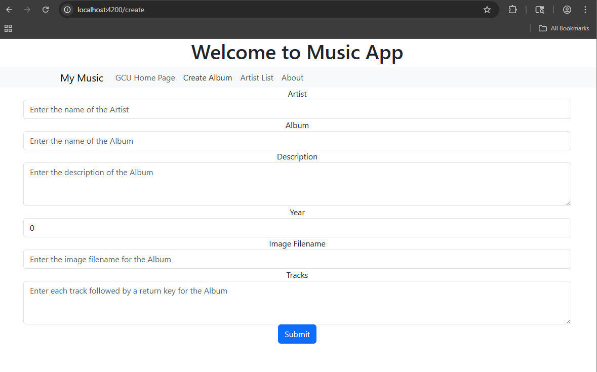

# Activity 4

- Author:  Hunter Bryant
- Date:  24 March 2026

## Introduction

- In this assignment I worked on refining my project and following the commands below. 

## Activity 4 Commands

```
npm install
npm install -g @angular/cli --latest
npm install jquery --save-dev
npm install bootstrap
npm install @popperjs/core
ng version
ng serve
```

## sample-music-data.json (missing)

- Download the file from here: [sample-music-data.json](https://gitlab.com/bobby.estey/gcu-cst391/-/blob/main/sample-music-data.json)
 
## Test Links

- http://localhost:4200

## Deliverables


- In this assignment I integrated the sample data into the project and worked on refining my web page. Below there are several sreenshots of what was completed and how my page looks at this moment. 

- Captioned screenshots with explanations of each page

- Here is an image of the clicking on the artists list button that then displays their albums when you select and artist
 

- Here is an image of the create album page


- Below is an image of the about page. there is no information on there yet just sample text


- Below is an image of the my music tab which displays all the artists in the database


## Troubleshooting

|Issue|Solution|
|--|--|
|ng new simpleapp --no-standalone|- Angular 17, when creating a new application without standalone requires the "--no-standalone" option to access the app.module.ts file|

## Conclusion

- I struggled a lot with activity 3 but once I got the program running again I was able to get the hang of it for now. 
     