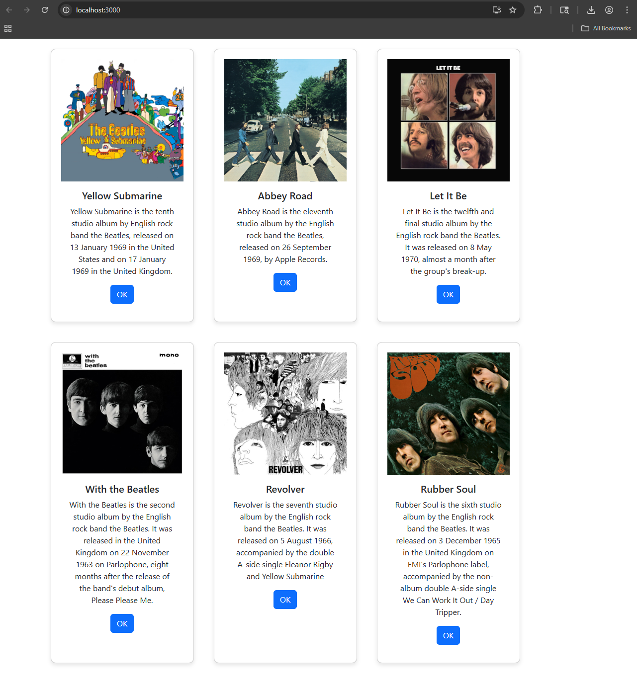

# Activity 5

- Author:  Hunter Bryant
- Date:  4 April 2026

## Introduction

- In this assignment I worked on adding more material to my site and creating a more professional appearance for users.  

## Test Links

- http://localhost:3000
- https://getbootstrap.com/docs/5.3/components/card/
- https://www.bootstrapcdn.com/

## Activity 5 Commands

```
mkdir activity5
cd activity5
npx create-react-app music
cd music/src
rm -rf *
cp ../../../../docs/topic05/index.js .
npm i bootstrap
```

## Deliverables

- Here is a screenshot of my application with 6 different albums being displayed. As well as all of the CSS needed. 



## Conclusion

- In this assignment I worked on getting all of the images and formatting write for the music app. I learned how to better use CSS and JS. 

