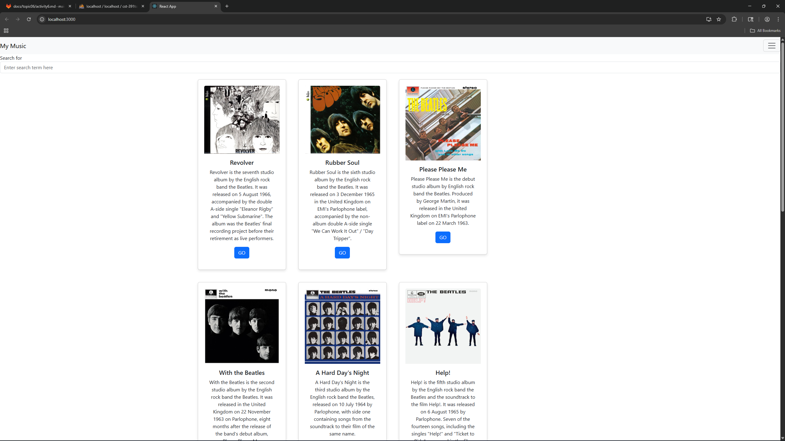
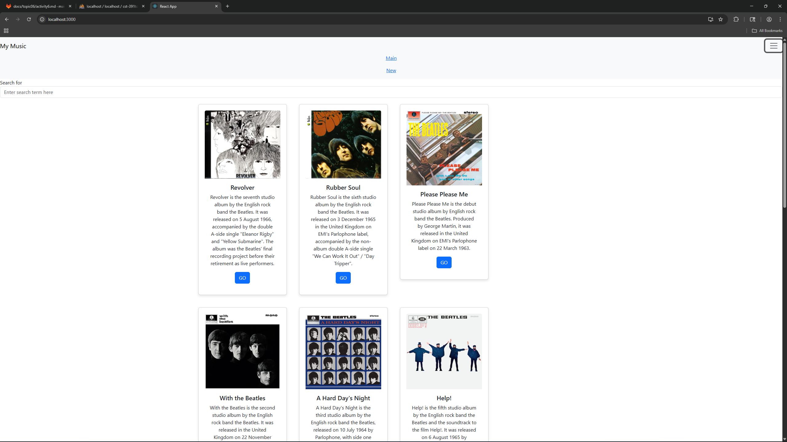
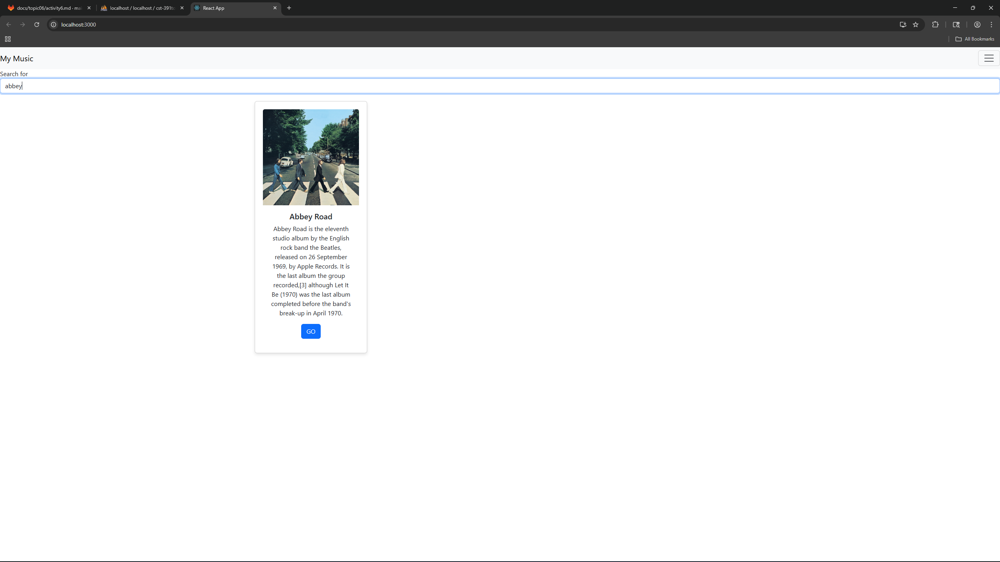
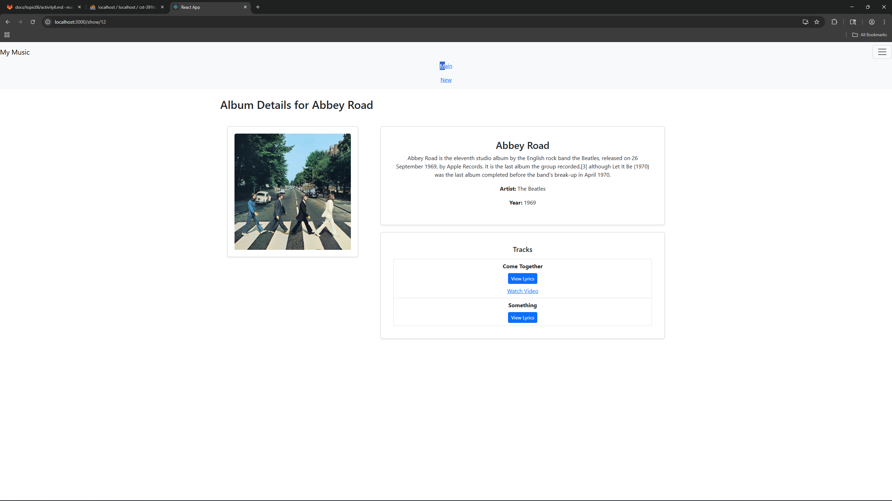
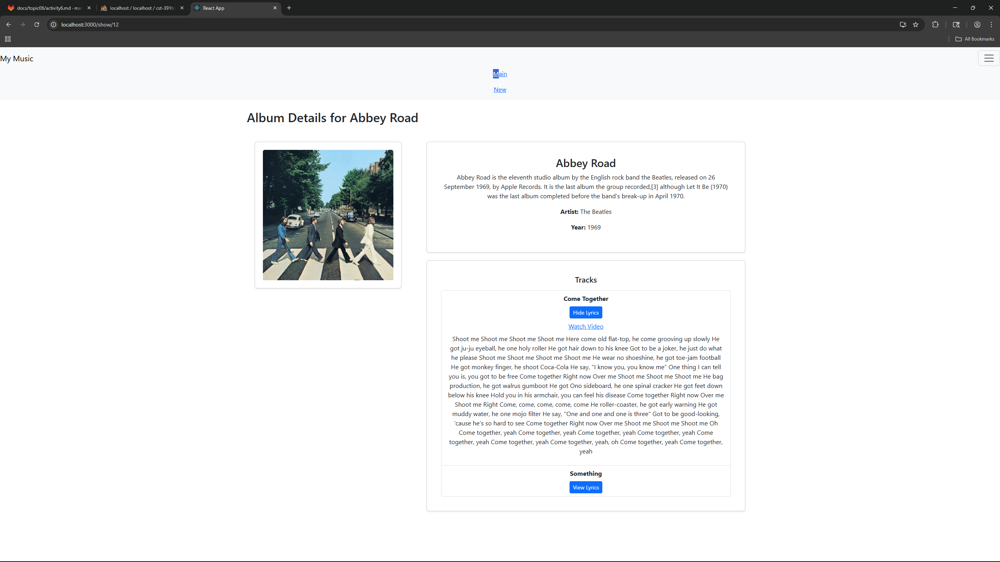
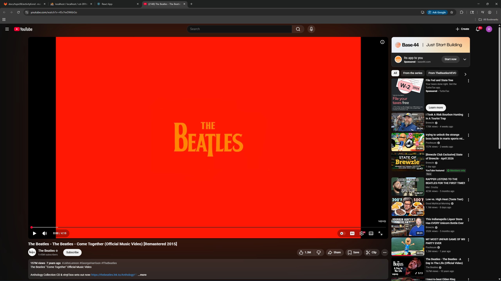
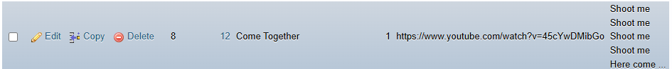

# Activity 6

- Author:  Hunter Bryant
- Date:  11 April 2026

## Introduction

- In this activity I used our RestAPI from activity one to make the database and front end code work together. I also worked to make the app look more appealing to the eye and have more smooth buttons/transitions. I added lyrics and videos to myphp so that way the user can view them through the app.  

## Activity 6 Commands

```
cd activity6

```

## Test Links

- http://localhost:3000

## Deliverables

- Take screenshots of the application you created
- Be sure to show the various features that were illustrated in this lesson

 
- Above is a screenshot of my webpage as soon as it is loaded up from the server.

 
- Above is a screen shot when the toggle for the navbar is clicked. Displaying the Main and New tabs

 
- Above is an image of the search function. Where it only displays albums based on what is being searched.

 
- Above is an image of the album details for the selected album. Here you can view songs under the album.

 
- Above is a screenshot when you click the view lyrics button. As well as the link to view the music video.

 
- Above is a screenshot of what is displayed after clicking on the watch video button. 

 
- Above is an imaged of the updated MyPhp that has lyrics and a music video link. 

## Summary of Features Added
 - A view lyrics button that allows the user to see all of the lyrics for each song
 - A watch video link that takes you to a youtube music video of the song selected
 - Added some html to make the page seem cleaner and easier to navigate for the user

## Conclusion

- I learned how to better use MyPhp and how useful it can be while creating an app that has full function and data. I also learned a little more about css and working with html in the front end code. 

## Troubleshooting

|Issue|Solution|
|--|--|
|||||

