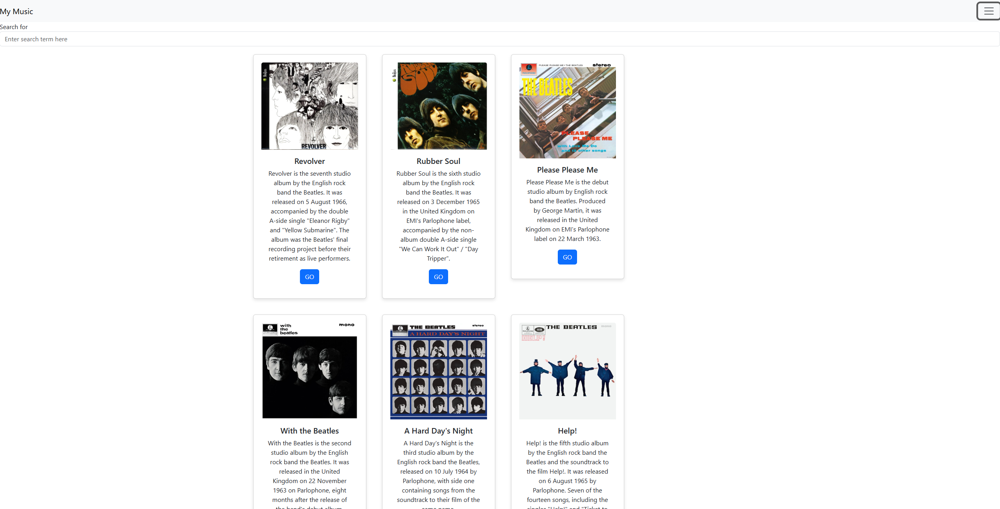
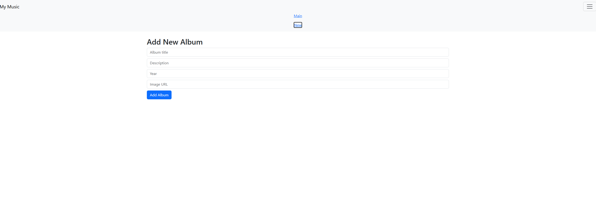
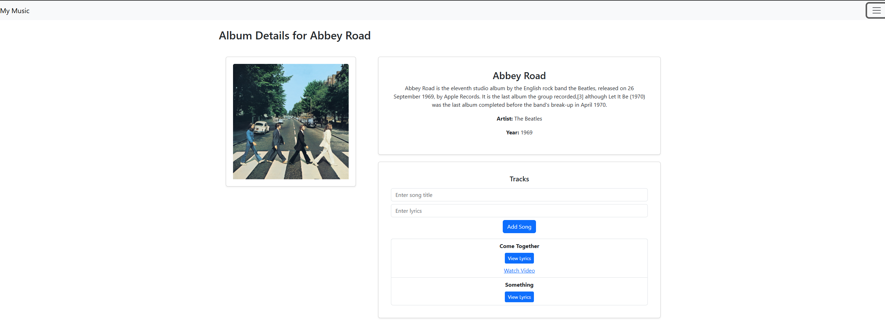
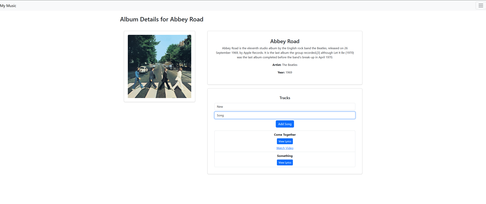
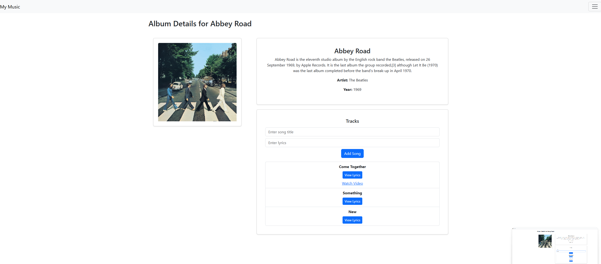

# Activity 7

- Author:  Hunter Bryant
- Date:  16 April 2026

## Introduction

- In this assignment I worked on adding the "Add new Album" page that was viewable through the nav bar. I also added an edit album button so you can add new songs to that album including the lyrics. 

## Activity 7 Commands

```
cd activity1/MusicAPI
npm start
```


```
cd activity7/music
npm start
```


## Test Links


## Deliverables

- Executive Summary
    - Added new Add Album page
    - Added an edit album button
    - other changes explained through images. 
- Captioned screenshots with explanations of each page

Below is a screenshot of just the base site after being loaded up.

 

    - Below is an image of the add new album page

 

    - Below is a screenshot of the new layout for the display album page

 

    - Here I am adding the new album name and lyrics 

 

    - And here you can see that it is automatically displayed including the lyrics.

 

- Write a one-paragraph summary of the new features that have been added
  - Most of the features that I have added are to improve on what I start on last week. Finalizing the edit album page and creating the add new album page as well. 

## Conclusion

- I learned how to add a new album and get it to show up on my SQL once you add it through localhost. That was something I did not know how to do before. 

## Troubleshooting

|Issue|Solution|
|--|--|
||||
