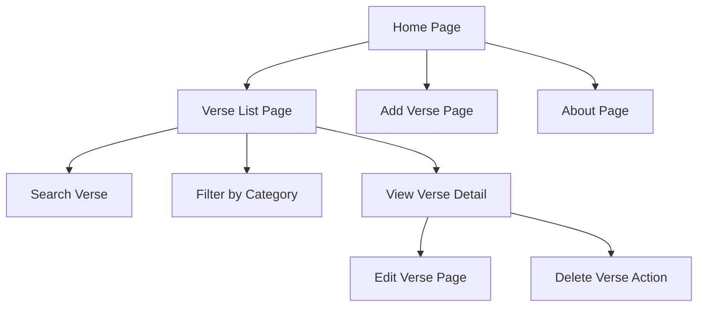
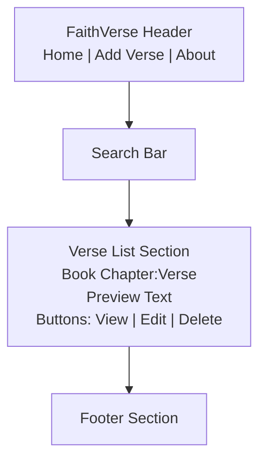
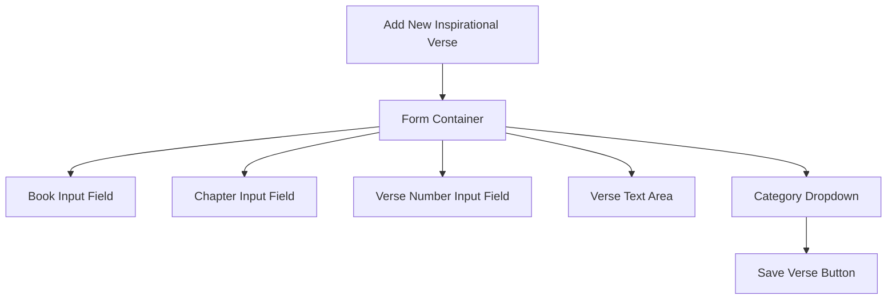
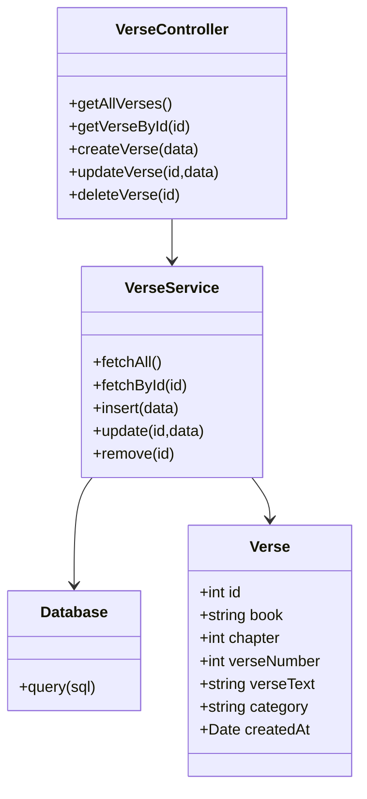

# Milestone 1 

- Author: Hunter Bryant
- 7 March 2026

## Introduction

- The FaithVerse application is a web-based platform designed to help users track and access inspirational Christian Bible verses. The purpose of this application is to provide a simple, organized way to store, manage, and view meaningful verses for personal encouragement, devotion, and study.

- The application will be developed using a full-stack architecture consisting of NodeJS and Express for backend services, MySQL for database storage, and Angular and React for frontend development. The backend will function as a REST API façade that handles database communication and basic business logic.

- The application supports creating, reading, updating, deleting, and listing verse entries. Users can add new verses, edit existing verses, remove verses, and browse stored verses through the web interface.

## Requirements

1. Add new Bible verses.

2. View a list of all stored verses so that you can browse available verses.

3. Read detailed information about a selected verse.

4. Update verse information so that corrections or improvements can be made.

5. Delete verses that are no longer needed.

6. Web application must be able to communicate with backend REST APIs built using Express and NodeJS.

7. Frontend application to be implemented twice, first using Angular and then using React.

## Sitemap

- Below is the Sitemap ... 

## Wireframes 

- Below are the Wireframes ... 

## UMLS

- Below are the UMLs

## Conclusion

- Throughout this assignment I learned the importance of planning a web page before even starting on the code. Starting off a project with a clean and organized workspace and flow can really improve efficiency. I have also learned how Rest-APIs act as a bridge between the front and back ends of a web application. This assignment has gotten me more comfortable with Mermaid and all that Markdown is capable of. I am excited to continue learning more about Markdown and taking full advantage of its benefits. The preparation in Milestone 1 will make the future milestones much easier to accomplish.  