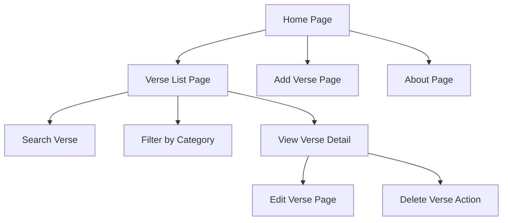
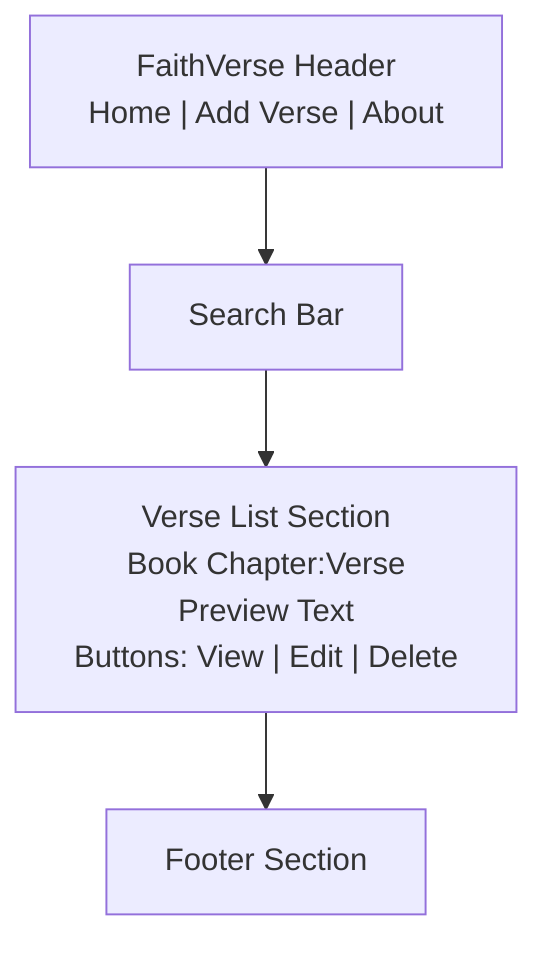
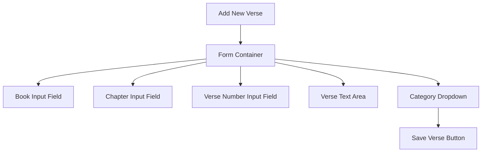
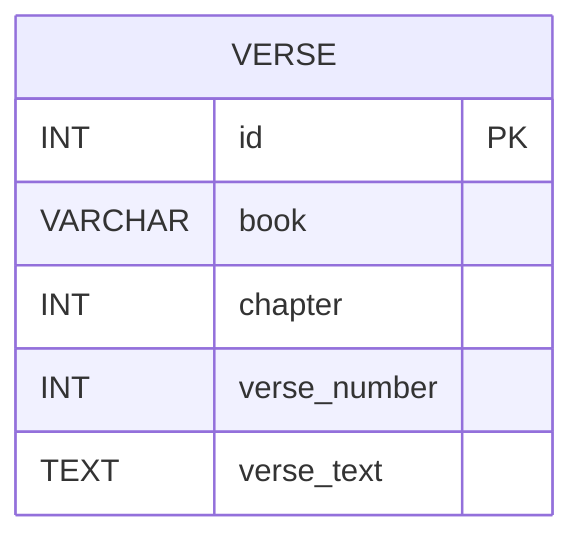
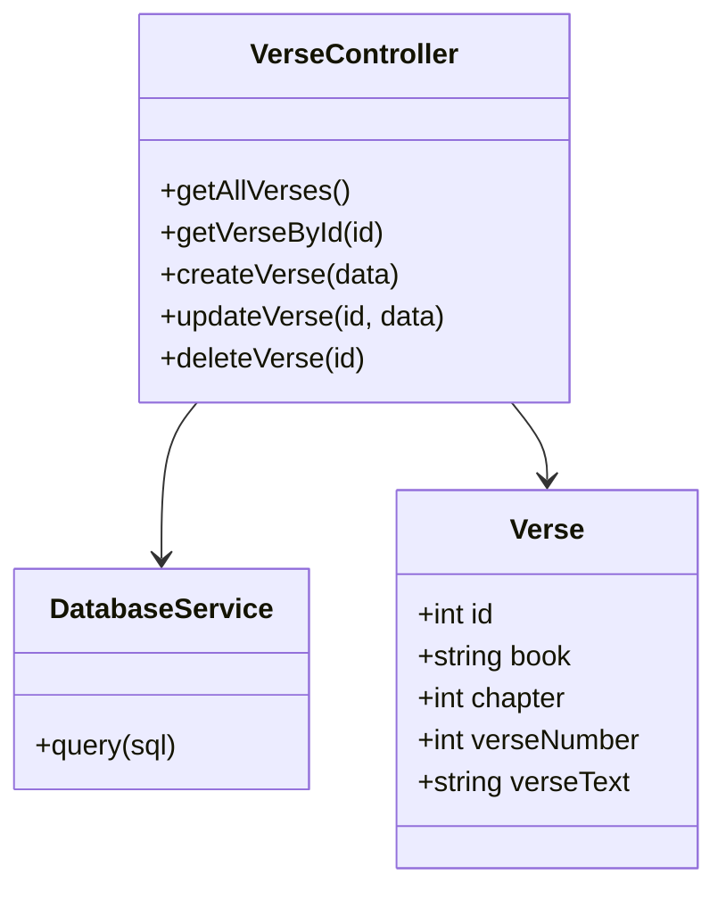

# Milestone 2 

- Author: Hunter Bryant
- Date: 10 March 2026

## Introduction

- The FaithVerse application is a web-based platform designed to help users track and access inspirational Christian Bible verses. The purpose of this application is to provide a simple, organized way to store, manage, and view meaningful verses for personal encouragement, devotion, and study.

- The application will be developed using a full-stack architecture consisting of NodeJS and Express for backend services, MySQL for database storage, and Angular and React for frontend development. The backend will function as a REST API façade that handles database communication and basic business logic.

- The application supports creating, reading, updating, deleting, and listing verse entries. Users can add new verses, edit existing verses, remove verses, and browse stored verses through the web interface.

## Requirements 

1. Add new Bible verses.

2. View a list of all stored verses so that you can browse available verses.

3. Read detailed information about a selected verse.

4. Update verse information so that corrections or improvements can be made.

5. Delete verses that are no longer needed.

6. Web application must be able to communicate with backend REST APIs built using Express and NodeJS.

7. Frontend application to be implemented twice, first using Angular and then using React.

## Sitemap 

- Below is the sitemap


- The sitemap diagram illustrates the overall structure and navigation flow of the FaithVerse web application. The Home Page serves as the main entry point for the application and provides navigation links to the primary functional areas of the system.

## Wireframes

- Below are the wireframes...




- The wireframes represent visual layouts of the application's user interface. These designs focus on the placement of elements and the structure of each page rather than detailed styling or visual design.

## Database Design

- The following diagram is the Entity Relationship Diagram (ERD) showing...the structure of the database used by the FaithVerse application. The ERD represents how data is organized and stored within the MySQL database.



## Class Diagrams

- The following diagrams are the Class diagrams showing...the object-oriented design used in the backend services of the application. The diagram shows the primary classes and how they interact with each other to process requests from the client applications.



## Rest Endpoints

- The Endpoints used in this...

|Method|Endpoint| Description|
|--|--|--|
|GET|verses|Retrieve a list of all verses|
|GET|verses/:id|Retrieve verse|
|PUT|verses/:id|Update verse|
|DELETE|verses/:id|Delete verse|

## API Example API Requests
```json
  GET /verses
  Response:
  [
    {
      "id": 1,
      "book": "John",
      "chapter": 3,
      "verse_number": 16,
      "verse_text": "For God so loved the world that he gave his one and only Son...",
    },
    {
      "id": 2,
      "book": "Psalm",
      "chapter": 23,
      "verse_number": 1,
      "verse_text": "The Lord is my shepherd; I shall not want."
    }
  ]
```


## Conclusion 

- During this assignment, I learned how important it is to properly plan a database design before actually creating the database. By thinking through the structure ahead of time using an ER diagram and identifying the necessary fields and data types, it helps make the implementation process much smoother. I also gained more experience using Markdown and Mermaid to create diagrams and organize information in a clear and readable way. Learning how to format diagrams and tables correctly helped me present the technical details of the project more effectively. Overall, this assignment helped me better understand the planning phase of a web application and how proper design makes development easier later on.