# Milestone 5

- Author:  Hunter Bryant
- Date:  18 April 2026

## Introduction

- The FaithVerse application is a web-based platform designed to help users track and access inspirational Christian Bible verses. The purpose of this application is to provide a simple, organized way to store, manage, and view meaningful verses for personal encouragement, devotion, and study.

- The application will be developed using a full-stack architecture consisting of NodeJS and Express for backend services, MySQL for database storage, and Angular and React for frontend development. The backend will function as a REST API façade that handles database communication and basic business logic.

- The application supports creating, reading, updating, deleting, and listing verse entries. Users can add new verses, edit existing verses, remove verses, and browse stored verses through the web interface.

## Requirements

1. Add new Bible verses.

2. View a list of all stored verses so that you can browse available verses.

3. Update verse information so that corrections or improvements can be made.

4. Delete verses that are no longer needed.

5. Web application must be able to communicate with backend REST APIs built using Express and NodeJS.

## Sitemap

- Below is the Sitemap ...

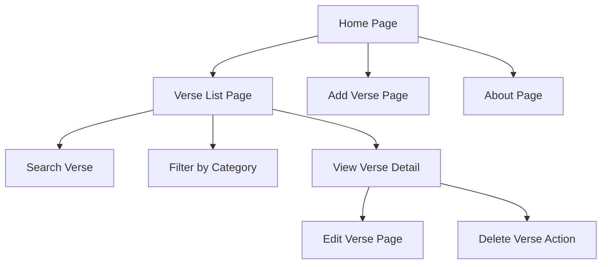
- The sitemap diagram illustrates the overall structure and navigation flow of the FaithVerse web application. The Home Page serves as the main entry point for the application and provides navigation links to the primary functional areas of the system.

## Wireframes

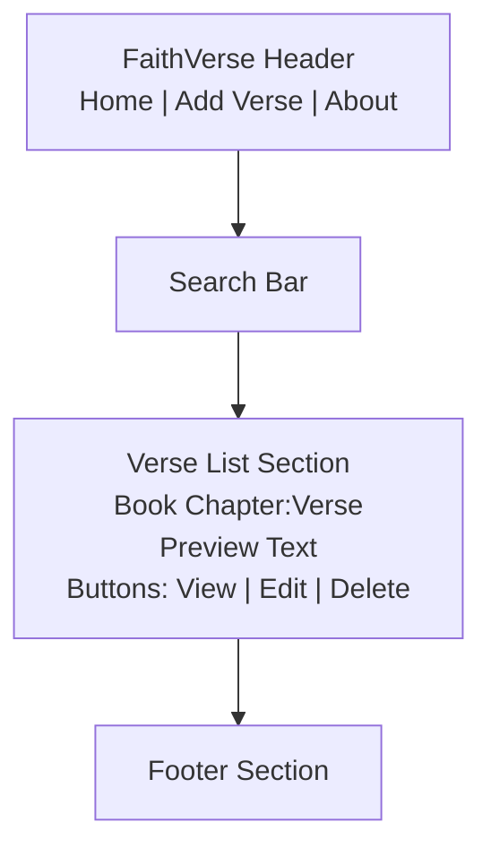

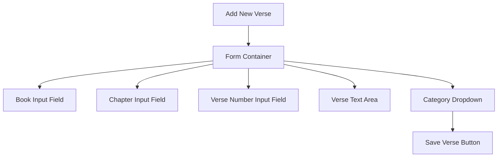
- The wireframes represent visual layouts of the application's user interface. These designs focus on the placement of elements and the structure of each page rather than detailed styling or visual design.

## Database Design

- The following diagram is the Entity Relationship Diagram (ERD) showing...the structure of the database used by the FaithVerse application. The ERD represents how data is organized and stored within the MySQL database.

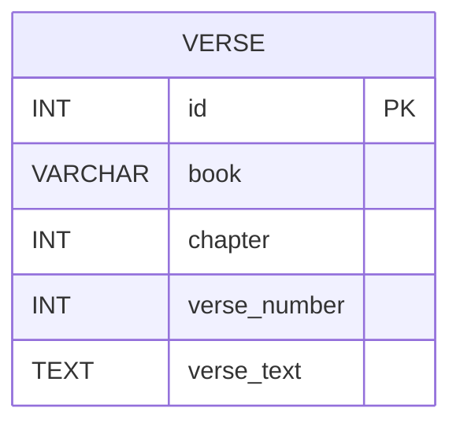

## Class Diagrams

- The following diagrams are the Class diagrams showing...the object-oriented design used in the backend services of the application. The diagram shows the primary classes and how they interact with each other to process requests from the client applications.

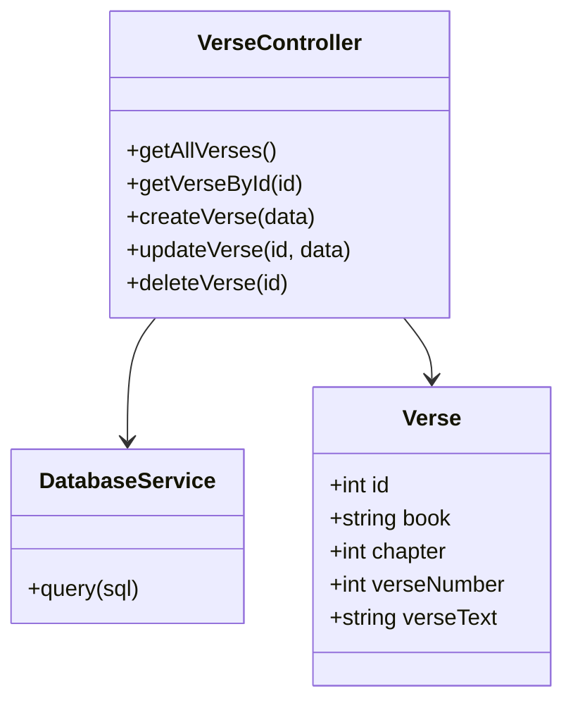


## REST Endpoints

- The Endpoints used in this ...

|Method|Endpoint| Description|
|--|--|--|
|GET|verses|Retrieve a list of all verses|
|GET|verses/:id|Retrieve verse|
|PUT|verses/:id|Update verse|
|DELETE|verses/:id|Delete verse|

## API Example API Requests

```json
  GET /presidents
  Response:
  [
    {
      "id": 26,
      "title": "Theodore Roosevelt",
      "born": "1858-10-27"
      "ageOfPresidency", "42",
      "notes", "Youngest President, ...",
      ...
    },
    {
      "id": 35,
      "title": "John Kennedy",
      "born": "1917-05-29"
      "ageOfPresidency", "43",
      "notes", "Served United States Navy ...",
      ...
    }
  ]
```
## Conclusion

- Below are screenshots of my current application: 

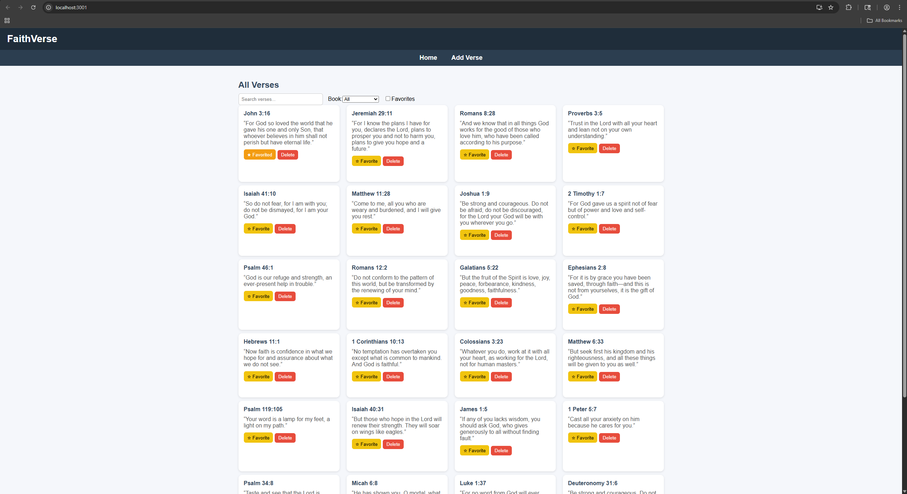
- Above is the base application when you start it through the terminal (homepage)

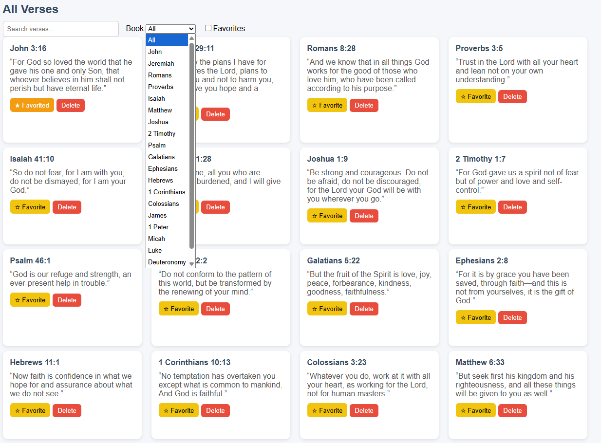
- Above is an image of the book filter option, where it will only show verses that are within the selected verse. 

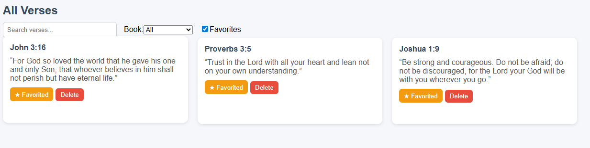
- Above is an image of favorites filter. Only showing the verses that have a filled in star marking it as a favorite. 

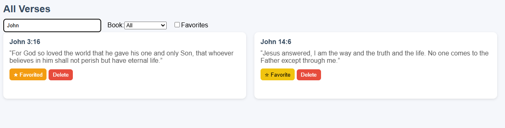
- Above shows the search function, where it will only show the verses of what is being typed in the search bar

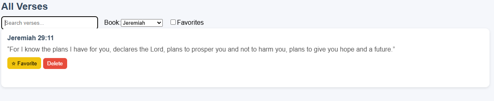
- Above is another example of the book filter function, I have Jeremiah selected so only verses from that book will appear. 

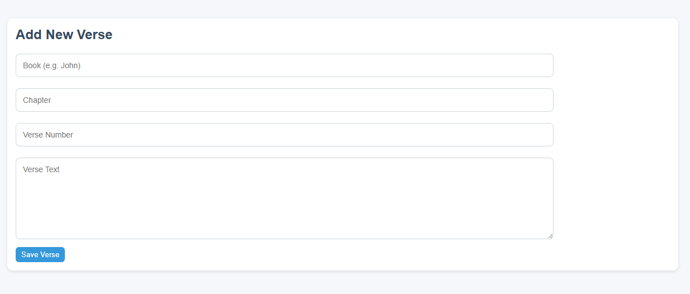
- Above shows the add new verse page where you can create new verses that will be added to the database. 

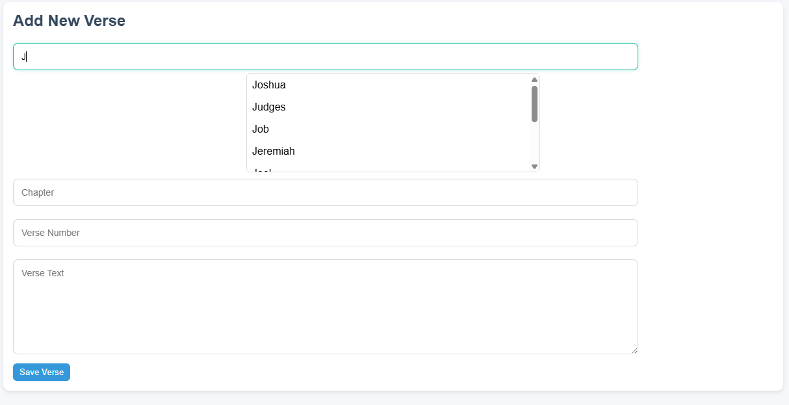
- Above is an image of the suggested text box, if you type a j then the books that start with a j will appear making it much faster to add new verses. Pressing tab will auto fill the top suggestion. 

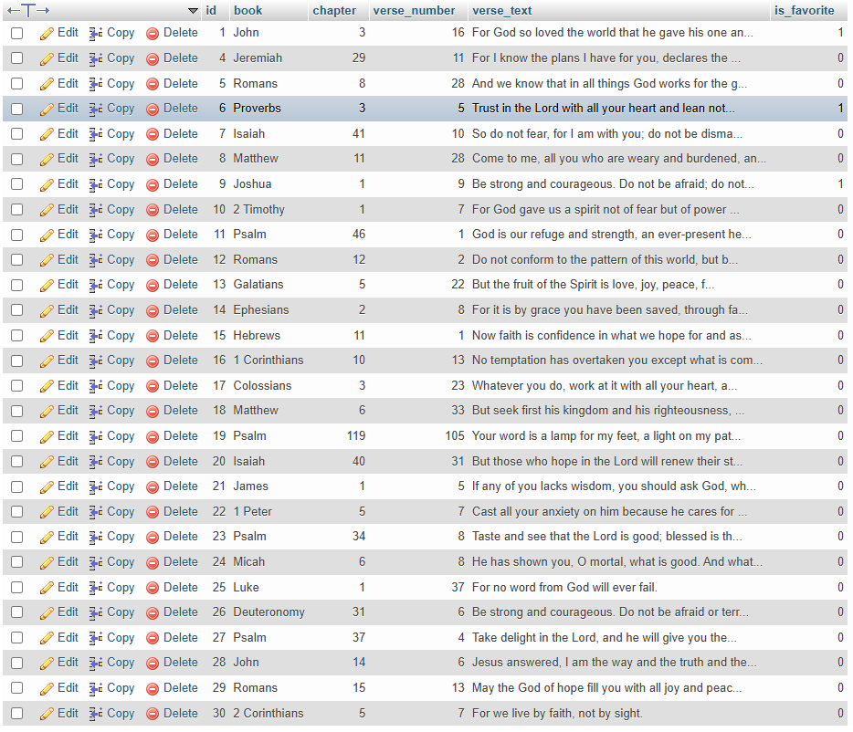
- This final image shows the database table that is behind the code. Here you can see the is_favorite column which saves once the favorite button is pressed on the verse. Compare to the favorite image above. 


- [Loom Video](https://www.loom.com/share/27fba7c9117944508a121964fb9de142)